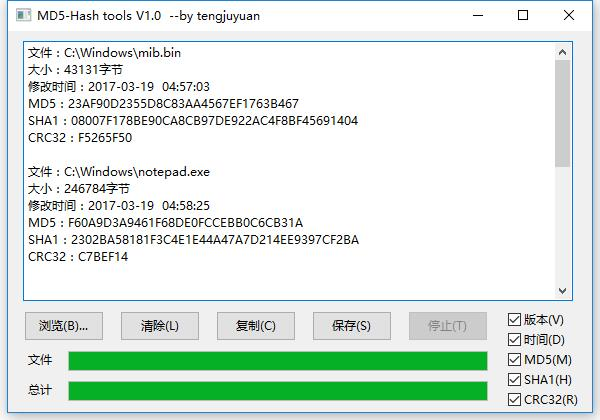

## 文件校验工具
### 项目介绍
MD5校验工具用MD5算法根据下载的文件数据算出来一个校验字符串，然后和服务器上人家之前生成的对比，看看是不是一样，目的是为了验证下载后的文件数据和服务器上的原始文件数据有没有偏差。

本项目主要是需要自己参考网上的Hash校验工具，制作一个基于python语言的校验小工具。

### 程序说明
- 作者：tengjuyuan
- 版本：v1.0
- 程序功能：实现对多个文件进行MD5,SHA1和CRC32校验。
---
#### 功能说明：
本工具是基于wxpython做的界面的,需要安装wxpython，在终端中输入以下安装命令：
```
pip3 install wxpython
```

界面如下图所示：



功能有：
    
    1、只支持常用的MD5、SHA1、CRC32算法；
    2、支持多个文件或文件夹拖放操作；
    3、支持停止、重新开始计算操作；
    4、支持Windows任务栏进度条效果；